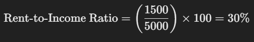

# Apartment Analysis around KL & Selangor

This project demonstrates a simple analysis on apartment around KL and Selangor. There report will be shown in PowerBi and clean by pandas.  

**Analysis Foresee:**

Objective:

 1. To clean and analyze the data of Apartment around KL & Selangor
 2. To obtain insight on the apartment for business and consumer sight:
    - Foresee risk property investment (**Business Goal:**)
    - Affordable house rent (**Consumer Goal:**)

Source: Kaggle

## Data Insight
Question build:

1. **How do the price of games on the Steam Store impact the total of ownership?**

2. **How does game genre affect average playtime for specific?**

3. **How do user ratings effect game sales success on the Steam Store?**

 4. **Between free and paid games, which does player prefer to play?**

### Business question answer

Data Details:

Data Descriptions:

## Data Chart:

#### Foresee risk property investment 
- **Property Condition:**
    Age of the property (2025 - completion year): new, moderate, and old
    
    Maintanance fee accomandate:
    | Year     | Price (RM) (annually)|
    | :-------- | :------- |
    | `0–10` | `2.25 per sq. ft.` | 
    | `10–20` | `4.49 per sq. ft.` | 
    | `20+` | `8.99 per sq. ft.` |

    Formula = age (current - completion) * price

    X, Y: property_type , completion_rate

    `Column chart`

- **Rental Market Risk:**
    
    Competition (number of similar rental properties):
    
    ↗ similiraty, ↗ Risk

    X, Y: property_type , competition_rate

    Vacancy rates (how many rental units are empty):

    ↗ vacancy, ↗ Risk (oversupply) 

    X, Y: district , vacancy_rate

    `Column chart`

#### Affordable house rent
- **Rental Prices:** 
    Current rental rates. Average rent per square foot/meter
- **Income Data:**

    Median household income by area

    X, Y: district , median_rent
    
    `Demographic chart`    

- **Market Segmentation:**

    Helps identify areas that cater to specific income groups (affordable, steady, luxury).

    Formula: 
    
    
    > - less 30%: Rent is generally considered affordable.
    > - 30%-50%: Rent is becoming burdensome.
    > - Above 50%: Rent is considered highly unaffordable and may indicate financial stress.

    | Type     | Income (RM) |
    | :-------- | :------- |
    | `Affordable (B40)` | `less 4849` | 
    | `Steady (M40)` | `4850 - 10959` | 
    | `Luxury (T20)` | `10960 more ` |

    X, Y: district , income_group

    `Histogram chart`

- **Property & Facilitiy Features:**

    Size and type of rental units included utilities or amenities

    X, Y: district , income_group

    `Histogram chart`

## Analysis Knowledge
