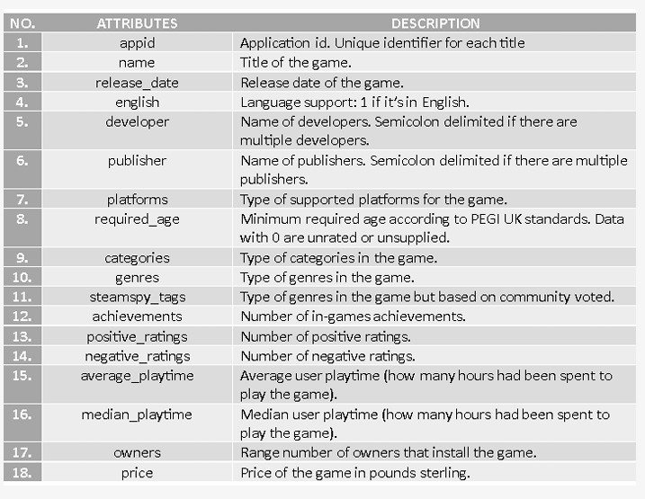
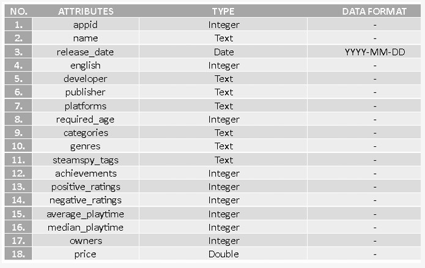
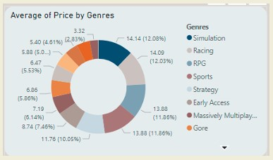
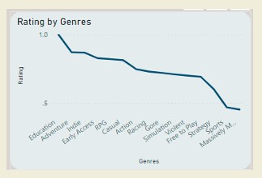
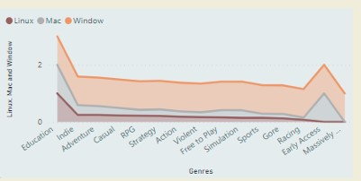

# Steam Game Analysis

This project demonstrates an analysis on steam game dateset. There report will be shown in PowerBi and clean by pandas.  

**(Disclaimer: Material used for educational purpose)**

**Analysis Foresee:**

Objective:

 1. To collect and analyze the data of Steam Store
 video game sales
 2. To design interactive dashboard for visualize the
 data of Steam Store game sales
 3. To obtain insight on the video game sales in
 Steam Store platform

Source: [Kaggle](https://www.kaggle.com/datasets/nikdavis/steam-store-games)

## Data Insight
Question build:

1. **How do the price of games on the Steam Store impact the total of ownership?**

2. **How does game genre affect average playtime for specific?**

3. **How do user ratings effect game sales success on the Steam Store?**

 4. **Between free and paid games, which does player prefer to play?**
### Business question answer

Data Details:

Data Descriptions:

## Data Chart

`Treemap chart`

- The graph represents how much times user spent to play the games on each genre

`Treemap chart`

- The graph represents average price of games in each genre.

`Treemap chart`

- The graph represents ratings of games in each genre.

`Treemap chart`

-  The chart depicts the distribution of game genres across different soperating systems (OS).

## Analysis Knowledge
 1. **Price of games has not give much impacts** on the ownership of the game since customer may be considering other
 factors to own a game such as brand reputation, hype, features and the genre of the game, User did not bother to spend
 more to own a game that satisfies all their preference.
 2. **Game genre has significant effect on the average playtime** since game genre related to user's interest. For example, if a
 user interest in sports, then the game that will played the most is sports game.
 3. **User rating does not have consistent effect on games sales.** There are games that still have high sales even though there
 are many negative reviews. It is due to review is based on personal preference. If one user did not like the game, it does
 not mean other will dislike it too.
